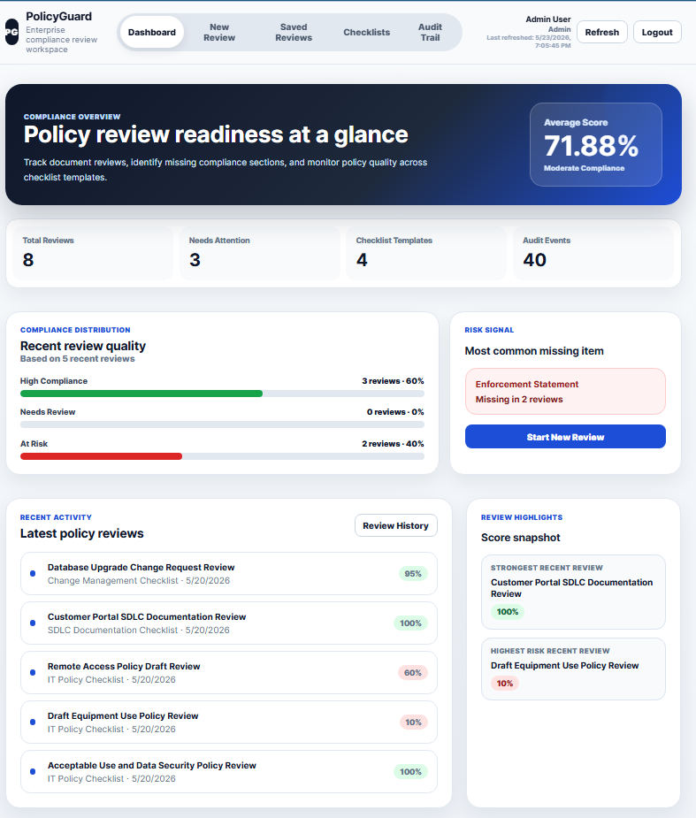
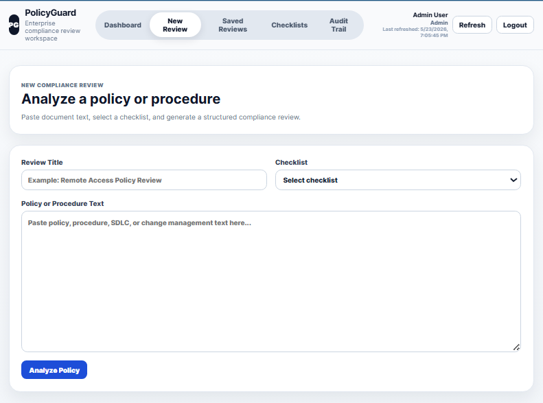
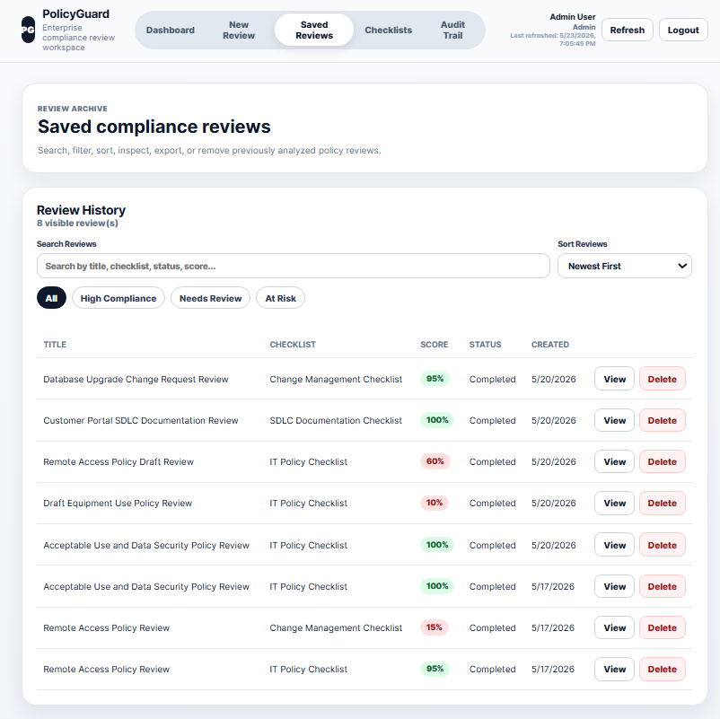
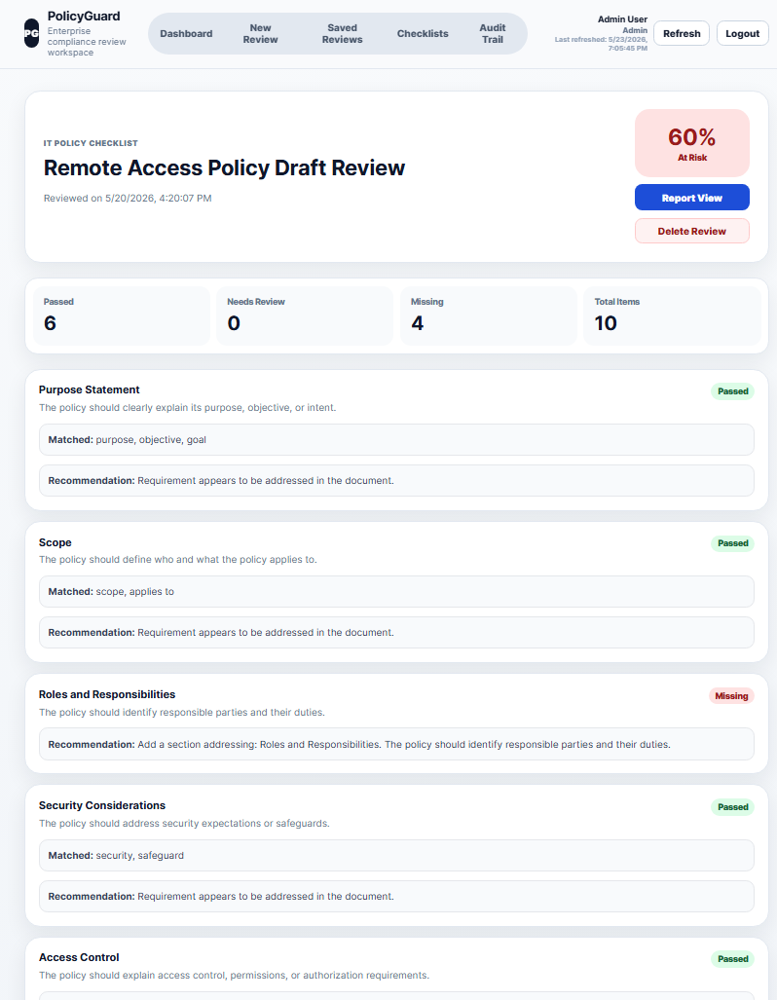
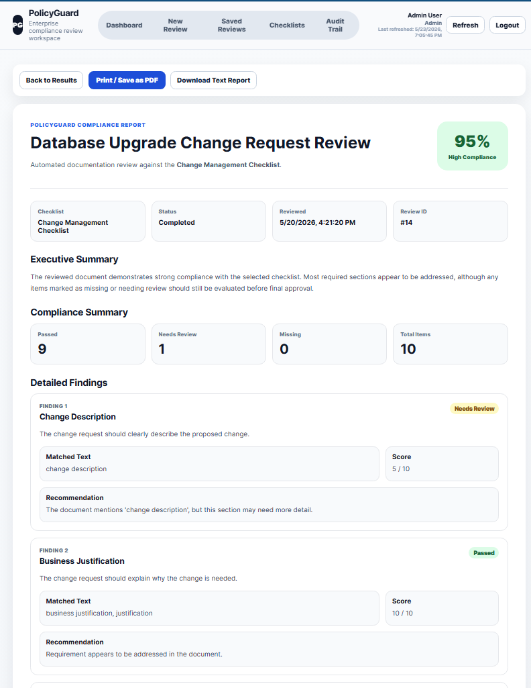
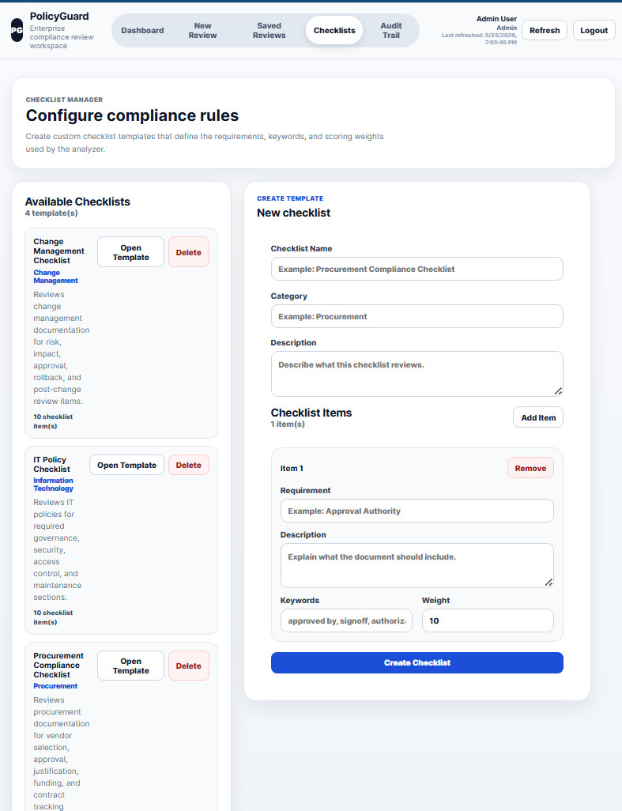
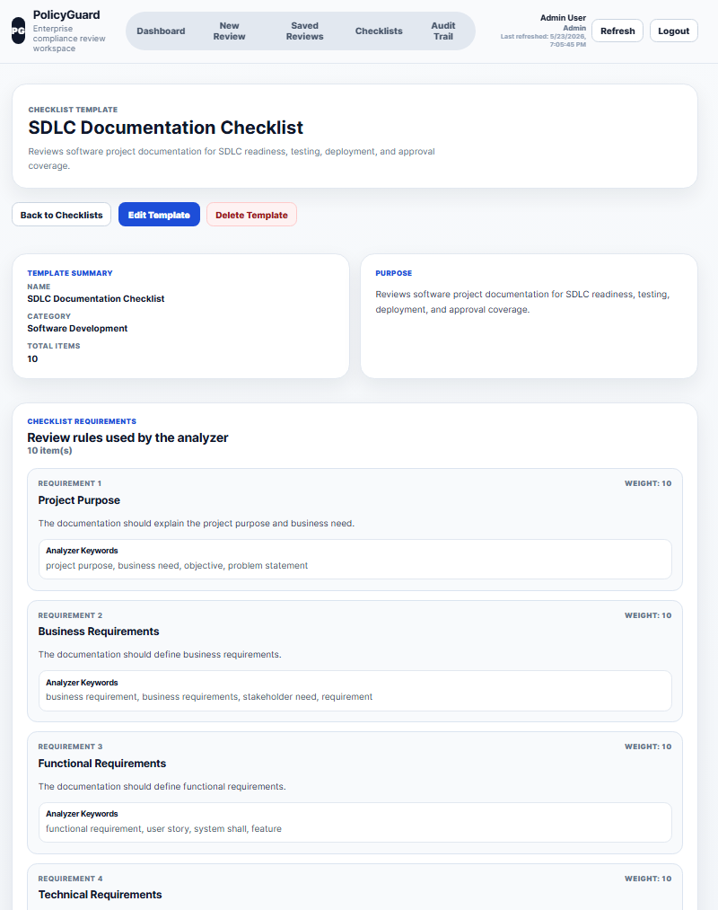
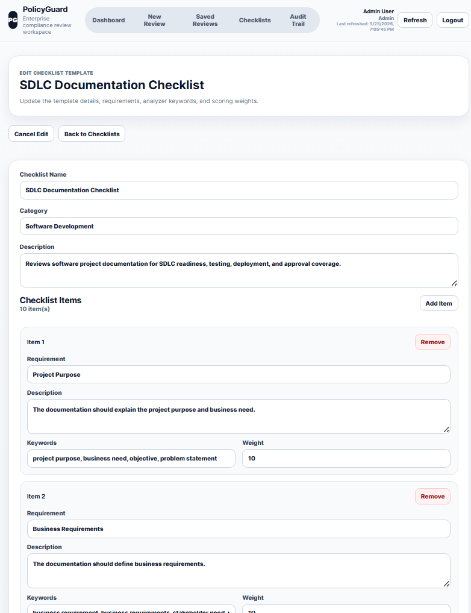
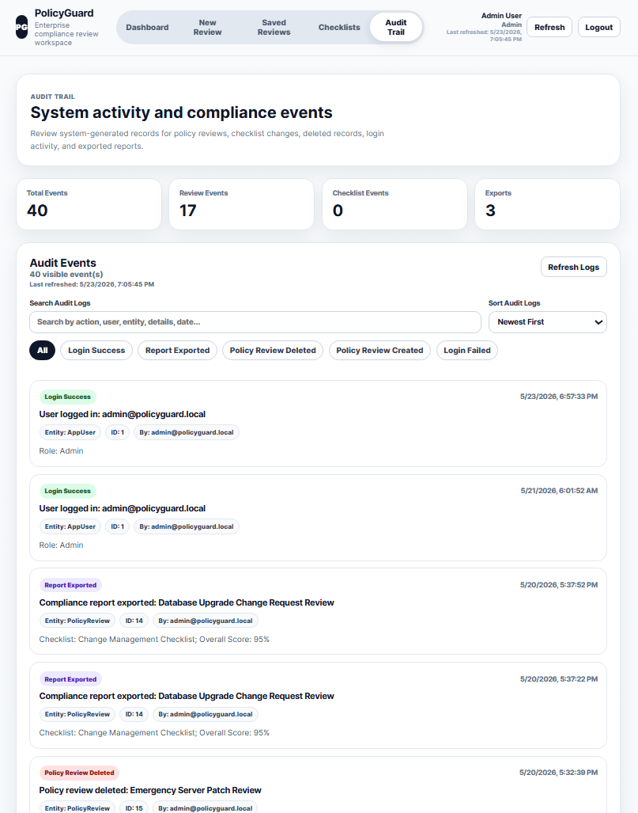
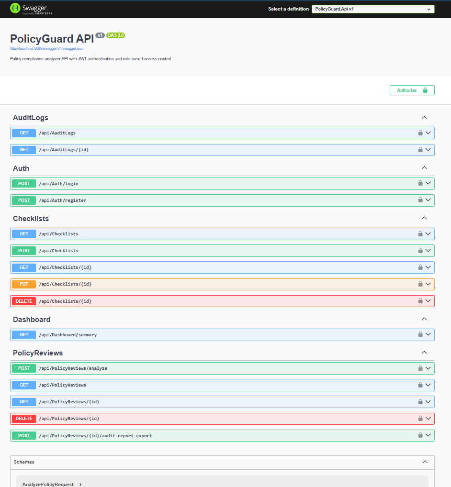

# PolicyGuard Compliance Analyzer

PolicyGuard is a deployed full-stack compliance review application built with ASP.NET Core, React, SQL Server/Azure SQL, Entity Framework Core, JWT authentication, role-based access control, audit logging, and Azure cloud deployment.

The application allows users to log in by role, create compliance checklist templates, analyze policy or procedure text against structured requirements, review compliance results, generate report-style output, and track user activity through an audit trail.

---

## Live Deployment

- **Frontend:** https://zealous-field-0e465511e.7.azurestaticapps.net

The deployed system uses Azure Static Web Apps for the React frontend and an Azure-hosted ASP.NET Core Web API behind the application. The README intentionally lists only the user-facing frontend URL.

---

## Enterprise Upgrade Highlights

- Deployed frontend on Azure Static Web Apps
- Deployed ASP.NET Core API on Azure App Service
- Production API configuration through Azure App Service environment variables
- Vite frontend environment configuration through GitHub Actions variables
- SQL Server / Azure SQL persistence with Entity Framework Core
- JWT-based authentication and role-based access control
- Audit trail for login, review, checklist, delete, and export activity
- xUnit test project for backend business logic and password behavior
- GitHub Actions CI/CD pipeline for backend build/test, frontend build, Docker validation, and Azure deployment
- Dockerfile for API container build validation
- Deployment guide in `docs/DEPLOYMENT.md`

---

## Features

- JWT-based authentication
- Role-based access control
- Admin, Reviewer, and Auditor user roles
- Compliance checklist creation, viewing, editing, and deletion
- Policy/procedure analysis against checklist requirements
- Saved policy review archive
- Search, filter, and sort controls for saved reviews
- Detailed review results with compliance scoring
- Exportable compliance report view
- Downloadable text report
- Audit trail for login, review, checklist, delete, and export events
- Audit search, filters, sorting, and refresh tracking
- Swagger API documentation in development/debug mode
- SQL Server persistence with Entity Framework Core

---

## Tech Stack

### Backend

- C#
- ASP.NET Core Web API
- Entity Framework Core
- SQL Server / Azure SQL
- JWT Authentication
- Role-Based Access Control
- xUnit
- Swagger / OpenAPI
- Docker

### Frontend

- React
- Vite
- JavaScript
- Axios
- CSS
- Responsive UI

### Cloud and DevOps

- Azure App Service
- Azure Static Web Apps
- GitHub Actions
- Azure environment variables
- Docker build validation
- CI/CD deployment workflow

---

## Screenshots

### Dashboard



### New Policy Review



### Saved Reviews



### Review Results



### Compliance Report View



### Checklist Manager



### Checklist Template Detail



### Edit Checklist Template



### Audit Trail



### Swagger API



---

## Application Roles

### Admin

Admins can manage the full application, including:

- Creating policy reviews
- Viewing saved reviews
- Deleting reviews
- Creating checklist templates
- Editing checklist templates
- Deleting unused checklist templates
- Viewing audit logs
- Exporting reports

### Reviewer

Reviewers can:

- Create policy reviews
- View saved reviews
- View checklist templates
- View review results
- Generate reports

Reviewers cannot manage checklist templates or delete reviews.

### Auditor

Auditors can:

- View saved reviews
- View checklist templates
- View audit logs
- Review compliance activity

Auditors cannot create policy reviews or modify checklist templates.

---

## API Overview

PolicyGuard exposes REST API endpoints for authentication, checklist management, policy review analysis, dashboard summaries, and audit logging.

Main API areas:

- `/api/Auth`
- `/api/Checklists`
- `/api/PolicyReviews`
- `/api/Dashboard`
- `/api/AuditLogs`

The API is documented through Swagger when enabled in development or debugging environments.

---

## Local Development Setup

### Prerequisites

Install the following before running the project:

- .NET 9 SDK
- Node.js 22+
- SQL Server Express
- Docker Desktop, optional but recommended
- Visual Studio Code or Visual Studio

### Backend Setup

Navigate to the backend project:

```bash
cd backend/PolicyGuard.Api
```

Restore dependencies:

```bash
dotnet restore
```

Apply EF Core migrations:

```bash
dotnet ef database update
```

Run the API:

```bash
dotnet run --launch-profile http
```

The local API runs at:

```text
http://localhost:5069
```

### Frontend Setup

Navigate to the frontend project:

```bash
cd frontend/policyguard-client
```

Install dependencies:

```bash
npm install
```

Run the React app:

```bash
npm run dev
```

By default, the local frontend calls:

```text
http://localhost:5069/api
```

For deployed environments, set:

```text
VITE_API_BASE_URL=https://your-policyguard-api.azurewebsites.net/api
```

---

## Azure Deployment Configuration

### Backend App Service Settings

The Azure App Service API uses environment variables for production configuration:

```text
ASPNETCORE_ENVIRONMENT=Production
Jwt__Key=<production-jwt-secret>
Jwt__Issuer=PolicyGuard
Jwt__Audience=PolicyGuardClient
Jwt__ExpirationMinutes=480
Cors__AllowedOrigins__0=<frontend-origin-url>
Swagger__Enabled=false
```

`Swagger__Enabled` can be temporarily set to `true` while debugging, then set back to `false` after deployment verification.

### Frontend Build Variable

The React frontend reads its API URL at build time through Vite:

```text
VITE_API_BASE_URL=<backend-api-url>/api
```

Because this value is baked into the production build, the frontend must be rebuilt and redeployed after changing it.

---

## GitHub Actions CI/CD

The repository includes a CI/CD workflow at:

```text
.github/workflows/ci-cd.yml
```

The pipeline runs on pull requests and pushes to `main`.

It performs:

- Backend restore
- Backend release build
- xUnit test execution
- Test result artifact upload
- API Docker image build validation
- Frontend dependency install
- Frontend production build
- Azure API deployment when Azure settings are configured
- Azure Static Web Apps frontend deployment when Azure settings are configured

Required GitHub repository variables:

```text
AZURE_WEBAPP_NAME=<azure-app-service-name>
VITE_API_BASE_URL=<backend-api-url>/api
```

Required GitHub repository secrets:

```text
AZURE_WEBAPP_PUBLISH_PROFILE
AZURE_STATIC_WEB_APPS_API_TOKEN
```

---

## Running Tests

Run backend xUnit tests:

```bash
dotnet test backend/PolicyGuard.Api.Tests/PolicyGuard.Api.Tests.csproj
```

The test suite currently covers:

- Policy analyzer pass/needs-review/missing logic
- Keyword trimming and case-insensitive matching
- Weighted compliance score calculation
- Score rounding
- Zero-weight checklist behavior
- Password hashing format
- Password verification success/failure paths
- Invalid stored password hash handling
- Unique password salts

---

## Docker

Build the API image from the repository root:

```bash
docker build -f backend/PolicyGuard.Api/Dockerfile -t policyguard-api:local .
```

Run the API container:

```bash
docker run --rm -p 8080:8080 \
  -e ASPNETCORE_ENVIRONMENT=Production \
  -e Jwt__Key="replace-with-a-long-local-test-secret" \
  -e ConnectionStrings__DefaultConnection="<your-connection-string>" \
  -e Cors__AllowedOrigins__0="http://localhost:5173" \
  policyguard-api:local
```

---

## Example Workflow

1. Admin logs in.
2. Admin creates or edits a compliance checklist template.
3. Reviewer creates a new policy review using one of the checklist templates.
4. PolicyGuard analyzes the document text against checklist requirements.
5. The user reviews the compliance score and detailed findings.
6. The user opens the report view and exports the report.
7. The audit trail records the login, review creation, report export, and other important events.

---

## Resume-Ready Talking Points

- Built and deployed a full-stack compliance analyzer with ASP.NET Core, React, SQL Server/Azure SQL, JWT authentication, RBAC, reporting, and audit logging.
- Deployed the frontend to Azure Static Web Apps and the API to Azure App Service using GitHub Actions CI/CD.
- Configured production environment variables for JWT signing, CORS, API routing, and frontend build-time API configuration.
- Added xUnit unit tests for backend business logic, weighted scoring behavior, password hashing, password verification, and invalid hash handling.
- Built a CI/CD pipeline that runs backend tests, validates frontend production builds, builds a Docker image, and deploys to Azure when cloud secrets are configured.

---

## Security Notes

This is a portfolio project. Demo access should be shared selectively. Production systems should use stronger account management, secret rotation, HTTPS-only settings, secure database firewall rules, and external identity providers where appropriate.
